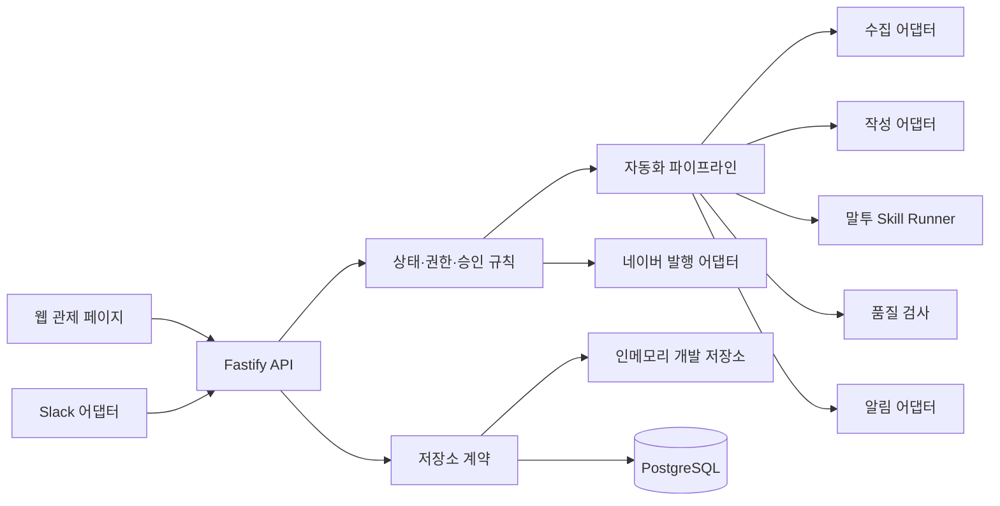

# 자동화 시스템 아키텍처

## 성공 기준

외부 키가 없는 로컬 환경에서도 콘텐츠 생성 요청부터 검토 대기까지 같은 업무 규칙으로 실행되고, 내일 실제 제공자를 연결할 때 어댑터만 교체한다.

## 구성

핵심 업무 규칙은 웹 화면, Slack, n8n, 외부 제공자에 두지 않는다. 모든 진입점은 같은 API와 상태 전이 규칙을 사용한다.

## 자동화 순서

1. 트렌드 수집
2. 공식 근거 검증
3. 기획서 생성
4. 초안 작성
5. SEO 최적화
6. GEO 최적화
7. 사람 말투 보정
8. 사실·검색·표현 품질 검사
9. 사람 검토 알림

각 단계는 `AutomationJob.steps`에 시작·완료·실패 시각을 남긴다. 초안 이후의 편집 단계는 기존 원고를 덮어쓰지 않고 `content_versions`에 새 버전을 만든다.

## 상태와 작업 실패 분리

콘텐츠 상태:

`idea → researching → brief_ready → drafting → review_ready → approved → scheduled → published → measured`

자동화 작업 상태:

`queued | running | succeeded | failed`

작업이 실패해도 콘텐츠 상태를 `failed`로 바꾸지 않는다. 예를 들어 말투 보정이 보호 문구를 바꾸면 콘텐츠는 `drafting`에 남고 작업만 `failed`가 된다. 이 구조로 실패 전까지 생성된 버전과 근거를 보존한다.

## 중복 방지

- 콘텐츠 생성: `creationKey`
- 파이프라인 실행: `idempotencyKey`
- 수집 자료: 정규화된 URL
- 발행 준비: 콘텐츠별 열린 발행 건 1개

클라이언트나 n8n이 같은 요청을 재전송해도 같은 키라면 새 콘텐츠·작업을 만들지 않는다.

## 저장소

기본 API는 `InMemoryAutomationRepository`로 즉시 실행된다. 운영에서는 비공개 GitHub 레포의 원고를 원본으로 유지하고 `PostgresAutomationRepository`가 콘텐츠·버전·검수·승인·실행 이력을 운영용으로 동기화한다. 초기 마이그레이션이 `carrot-company` 팀과 `carrot`, `github-actions`, `system` 사용자를 생성한다. GitHub 조회가 일시적으로 실패하면 PostgreSQL의 마지막 동기화 데이터를 사용한다.

## 외부 제공자 경계

`server/adapters/contracts.ts`가 다음 교체 지점을 정의한다.

- `TrendCollector`: 네이버·커뮤니티·YouTube
- `ResearchVerifier`: 공식 자료 수집·주장 장부
- `ContentGenerator`: 기획·초안·SEO·GEO
- `HumanToneRunner`: 기존 사람 말투 skill
- `QualityReviewer`: 사실·검색·광고 위험 검사
- `ReviewNotifier`: Slack 등 검토 알림
- `Publisher`: 네이버 발행 준비·실행

현재 `mock.ts`는 같은 계약을 결정론적으로 구현해 전체 흐름 테스트에 사용한다.
